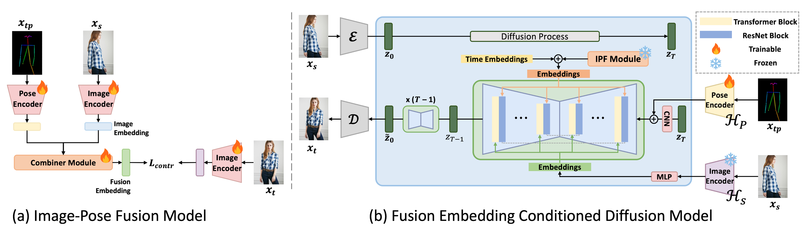
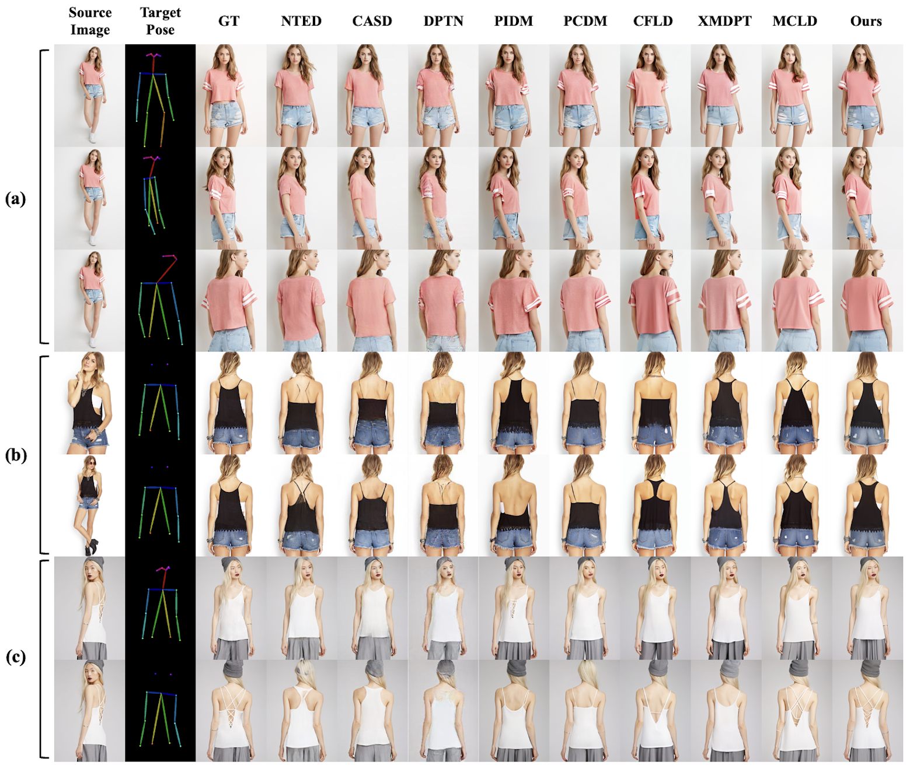

# FPDM

## Abstract

Pose-Guided Person Image Synthesis (PGPIS) aims to generate human images in specified poses 
while preserving the identity and appearance of a source image. This technology facilitates 
diverse applications, including e-commerce, digital avatars, and sign language generation. 
Despite the high-quality results of recent diffusion-based PGPIS, these models typically 
depend on implicit feature aggregation. This limits fine-grained texture preservation and
robustness under pose variations. To address these limitations, we propose Fusion Embedding 
for PGPIS using a Diffusion Model (FPDM), the first framework to explicitly align fused 
source–pose embeddings with target image embeddings via contrastive learning.
FPDM integrates an Image–Pose Fusion (IPF) module into our proposed Source-Enhanced Pose 
Fusion approach to learn a fusion embedding aligned with the target image. We then employ 
a conditional diffusion model guided by source appearance, target pose, and the learned
fusion embedding. Experiments on the DeepFashion benchmark and RWTH-PHOENIX-Weather 2014T
dataset demonstrate state-of-the-art performance in both quantitative and qualitative 
evaluations, with ablation studies confirming that explicit fusion embedding alignment 
substantially improves texture fidelity and pose-consistent synthesis. 

  
## Install Packages

~~~
pip install -r requirements.txt
~~~

## A. Dataset Preparation

---
- Due to file size limitations, we sampled only 5 pairs from the DeepFashion dataset for both the training and test sets.
- We will upload the full description after the review process is complete.
---
The proposed model is evaluated using the benchmark datasets DeepFashion In-shop Clothes Retrieval Benchmark 
(DeepFashion) (Liu et al., 2016) and RWTH-PHOENIX-Weather 2014T (Phoenix) (Camgoz et al., 2018).
The DeepFashion dataset contains 52,712 high-resolution fashion images, and we followed the data configuration 
described in Lu et al. (2024). The model was evaluated at resolutions of 256×176 and 512×352, with the input images
resized to 256×256 and 512×512, respectively. PHOENIX14T is a German sign language benchmark dataset consisting
of 7,738 videos, performed by nine different signers wearing dark clothes in front of a gray background, with a
resolution of 210×260 pixels. We followed the original dataset settings, using 7,096 videos for training and 642 
for testing. Pose images were generated by converting pose coordinates extracted using HRnet (Wang et al., 2020),
as provided by Guan et al. (2024). To construct the training data, we randomly extracted {source image, target pose,
target} triples from video units, generating a total of 100,000 pairs. For testing, we used the first frame as the 
source image and the target pose as the pose sequence for each frame in the video, creating a dataset of 
approximately 64,627 pairs.

___

### 1. Download Dataset

We used the DeepFasion dataset and RWTH-PHOENIX-Weather 2014T (Phoenix) datasets for our
experiments. The `DeepFasion` dataset can be downloaded from https://mmlab.ie.cuhk.edu.hk/projects/DeepFashion.html, and
we obtained the `pose coordinates` from https://github.com/tencent-ailab/PCDMs. 
For the `Phoenix` dataset, the official link is https://www-i6.informatik.rwth-aachen.de/~koller/RWTH-PHOENIX-2014-T/

### 2. Dataset Preprocessing

Run code `A1.pose_data_preprocessing.py` for data preprocessing

~~~
python A1.pose_data_preprocessing.py
~~~

Below table is data structure for reproducing our model

~~~
+-- ./data
|   +-- deepfashion_samples
|   |   +-- img
|   |   |    +--- MAN/../01_1_front.jpg
|   |   |    +--- WOMAN/../01_3_back.jpg
|   |   |    +--- ...
|   |   +-- pose
|   |   |    +--- MAN/.../01_1_front.txt
|   |   |    +--- WOMAN/.../01_3_back.txt
|   |   |    +--- ...
|   |   |    +--- ...
|   |   +-- pose_img
|   |   |    +--- MAN/.../01_1_front.jpg
|   |   |    +--- WOMAN/.../01_3_back.jpg
|   |   |    +--- ...
|   |   |    +--- ...
|   |   +-- train_pairs_data.json
|   |   +-- test_pairs_data.json
+-- ./logs
+-- ./src
+-- ...
~~~

&nbsp;

## B. Training Proposed Model

___
### 1. Train Stage 1 Fusion Model
To obtain the fusion embedding of image and pose, we trained our proposed model using CLIP-Large as the backbone 
of the image encoder module and combiner as the fusion module.   
- The CLIP pretrained model refers to
[this model](!https://huggingface.co/openai/clip-vit-large-patch14) on Hugging Face.
- The combiner module refers to [this model](https://github.com/ABaldrati/CLIP4Cir)
~~~
python B1.train_Fusion_model.py
~~~

&nbsp;

### 2. Train Stage 2 Conditioned Diffusion Model

We train the Stage 2 Conditioned Diffusion Model using the image-pose fusion embedding from the prior fusion model.
- The Stable Diffusion model was used for our diffusion model, which refers to
[this model](!https://https://huggingface.co/stabilityai/stable-diffusion-2) on Hugging Face.
~~~
python B2.train_Diffusion_model.py
~~~

&nbsp;

## C. Test Proposed FPDM Model

### 1. Synthesis Images From Test Dataset

Using the trained stage 2 Conditioned Diffusion Model, we generate images from the test dataset to evaluate our model.

~~~
python C1.test_Diffusion_model.py
~~~

### 2. Quantitative Evaluation
We evaluated the performance of our proposed FPDM model using several metrics. For the DeepFashion dataset, 
we used image pixel-level Structural Similarity Index Measure (SSIM),
Peak Signal-to-Noise Ratio (PSNR), Deep Feature-based Learned Perceptual Image Patch Similarity (LPIPS) 
, and Fréchet Inception Distance (FID) as evaluation metrics. 

~~~
python C2.eval.caculate_metrics.py
~~~

## D. Generated Results Examples
### 1. Generated Results on DeepFashion Dataset
All FPDM-generated images for the DeepFashion test set are available for download at the following link: 
[Download generated results (Google Drive)](!https://drive.google.com/file/d/1jCKOwRxTsTVoD2veDbjjWgDsUK1TE3hW/view?usp=drive_link)
  

### 2. Generated Results on Phoenix-2014-TG Dataset
Overall, the model preserves the source appearance while generating signers according to pose 
variations. However, when the pose quality is poor in certain frames, the quality of the generated 
images also degrades accordingly. Since FPDM is an image-based generation model, temporal 
inconsistencies and unnatural transitions between frames can be observed when the results are viewed 
as a video. In future work, we plan to extend FPDM to a video generation model to alleviate these 
limitations and improve overall video generation quality.

All generated result images of FPDM on the Phoenix-2014-TG test dataset can be downloaded from the following link:
[Download generated results (Google Drive)](!https://drive.google.com/file/d/1jCKOwRxTsTVoD2veDbjjWgDsUK1TE3hW/view?usp=drive_link)

