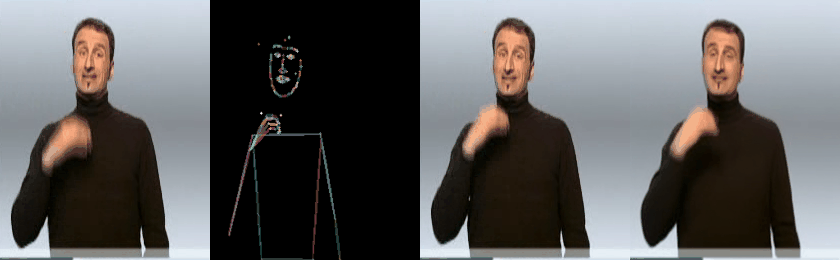
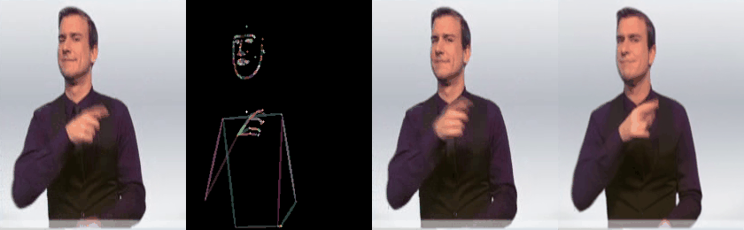

# FPDM

## Generated Results Examples
___

### 1. Generated Results on Phoenix-2014-TG Dataset
We apply the proposed FPDM to the Phoenix-2014-TG dataset to evaluate its ability to generate sign language
images conditioned on pose sequences while preserving signer appearance. As illustrated in the figure below,
the model consistently maintains the source signer’s identity and appearance across frames while effectively
adapting the generated outputs to target pose variations, demonstrating successful disentanglement of
appearance information from pose guidance and visually coherent transfer of pose dynamics. However,
the quality of the generated images is sensitive to the accuracy of the input pose, and frames with 
inaccurate or noisy pose estimates exhibit noticeable degradation, such as distorted body parts or unclear
hand shapes. Furthermore, since FPDM is an image-based generation model without explicit temporal modeling,
temporal inconsistencies—such as appearance flickering and unnatural transitions between consecutive 
frames—may arise when the results are viewed as a video, even if individual frames appear visually 
plausible. These observations highlight the limitations of frame-wise generation in capturing the long-range
temporal coherence required for sign language video generation, motivating future work to extend FPDM 
toward a video-based generation framework that explicitly models temporal dependencies to improve overall 
video generation quality.

&nbsp;&nbsp;&nbsp;&nbsp;&nbsp;&nbsp;&nbsp;&nbsp;&nbsp;&nbsp;Source
&nbsp;&nbsp;&nbsp;&nbsp;&nbsp;&nbsp;&nbsp;&nbsp;&nbsp;&nbsp;&nbsp;&nbsp;&nbsp;&nbsp;&nbsp;&nbsp;&nbsp;&nbsp;&nbsp;&nbsp;Pose 
&nbsp;&nbsp;&nbsp;&nbsp;&nbsp;&nbsp;&nbsp;&nbsp;&nbsp;&nbsp;&nbsp;&nbsp;&nbsp;&nbsp;&nbsp;&nbsp;&nbsp;&nbsp;&nbsp;&nbsp;&nbsp;&nbsp;&nbsp; GT 
&nbsp;&nbsp;&nbsp;&nbsp;&nbsp;&nbsp;&nbsp;&nbsp;&nbsp;&nbsp;&nbsp;&nbsp;&nbsp;&nbsp;&nbsp;&nbsp;&nbsp;&nbsp;&nbsp;&nbsp;&nbsp;&nbsp;&nbsp;&nbsp;Ours 

 
 
 
 
 

All generated result images of FPDM on the Phoenix-2014-TG test dataset can be downloaded from the following link:
[Download results (Google Drive)](https://drive.google.com/file/d/1L2mahCCh2FCjSKqp4JymH_oU8Tqysrq4/view?usp=sharing)

### 2. Generated Results on DeepFashion Dataset
FPDM generates visually coherent and consistent images under variations in both pose and source appearance.
It accurately preserves fine-grained clothing details and maintains their positional and shape consistency across 
different target poses and source variations, outperforming other state-of-the-art methods that often suffer from 
detail loss or inconsistency. Furthermore, FPDM demonstrates strong front-to-back visual continuity, indicating its 
ability to preserve structural integrity and produce high-quality pose-conditioned images.

All FPDM-generated images for the DeepFashion test set are available for download at the following link: 
[Resolution 512: Download results (Google Drive)](https://drive.google.com/file/d/18nxoIatPomHvVqk8KRXpGSpxAzDLV0HB/view?usp=sharing)
[Resolution 256: Download results (Google Drive)](https://drive.google.com/file/d/1NoPnP1H8kTq2NX-uY51GvANQvG2-Y683/view?usp=sharing)

  

[//]: # (### 3. Generated Results on Korean Sign Dataset)

[//]: # (FPDM을 사용하여 2022 Korean–Korean Sign Language Parallel Corpus Dataset을 학습하고 )

[//]: # ()
[//]: # (&nbsp;&nbsp;&nbsp;&nbsp;&nbsp;&nbsp;&nbsp;&nbsp;&nbsp;&nbsp;Source)

[//]: # (&nbsp;&nbsp;&nbsp;&nbsp;&nbsp;&nbsp;&nbsp;&nbsp;&nbsp;&nbsp;&nbsp;&nbsp;&nbsp;&nbsp;&nbsp;&nbsp;&nbsp;&nbsp;&nbsp;&nbsp;Pose )

[//]: # (&nbsp;&nbsp;&nbsp;&nbsp;&nbsp;&nbsp;&nbsp;&nbsp;&nbsp;&nbsp;&nbsp;&nbsp;&nbsp;&nbsp;&nbsp;&nbsp;&nbsp;&nbsp;&nbsp;&nbsp;&nbsp;&nbsp;&nbsp; GT )

[//]: # (&nbsp;&nbsp;&nbsp;&nbsp;&nbsp;&nbsp;&nbsp;&nbsp;&nbsp;&nbsp;&nbsp;&nbsp;&nbsp;&nbsp;&nbsp;&nbsp;&nbsp;&nbsp;&nbsp;&nbsp;&nbsp;&nbsp;&nbsp;&nbsp;Ours )

[//]: # ()
[//]: # ( )

[//]: # ( )

[//]: # ( )

[//]: # ( )
## Abstract

Pose-Guided Person Image Synthesis (PGPIS) aims to generate human images in specified poses 
while preserving the identity and appearance of a source image. This technology facilitates 
diverse applications, including e-commerce, digital avatars, and sign language generation. 
Despite the high-quality results of recent diffusion-based PGPIS, these models typically 
depend on implicit feature aggregation. This limits fine-grained texture preservation and
robustness under pose variations. To address these limitations, we propose Fusion Embedding 
for PGPIS using a Diffusion Model (FPDM), the first framework to explicitly align fused 
source–pose embeddings with target image embeddings via contrastive learning.
FPDM integrates an Image–Pose Fusion (IPF) module into our proposed Source-Enhanced Pose 
Fusion approach to learn a fusion embedding aligned with the target image. We then employ 
a conditional diffusion model guided by source appearance, target pose, and the learned
fusion embedding. Experiments on the DeepFashion benchmark and RWTH-PHOENIX-Weather 2014T
dataset demonstrate state-of-the-art performance in both quantitative and qualitative 
evaluations, with ablation studies confirming that explicit fusion embedding alignment 
substantially improves texture fidelity and pose-consistent synthesis. 

  

## A. Install Packages

~~~
pip install -r requirements.txt
~~~

## B. Dataset Preparation

---
- Due to file size limitations, we sampled only 5 pairs from the DeepFashion dataset for both the training and test sets.
- We will upload the full description after the review process is complete.
---
The proposed model is evaluated using the benchmark datasets DeepFashion In-shop Clothes Retrieval Benchmark 
(DeepFashion) (Liu et al., 2016) and RWTH-PHOENIX-Weather 2014T (Phoenix) (Camgoz et al., 2018).
The DeepFashion dataset contains 52,712 high-resolution fashion images, and we followed the data configuration 
described in Lu et al. (2024). The model was evaluated at resolutions of 256×176 and 512×352, with the input images
resized to 256×256 and 512×512, respectively. PHOENIX14T is a German sign language benchmark dataset consisting
of 7,738 videos, performed by nine different signers wearing dark clothes in front of a gray background, with a
resolution of 210×260 pixels. We followed the original dataset settings, using 7,096 videos for training and 642 
for testing. Pose images were generated by converting pose coordinates extracted using HRnet (Wang et al., 2020),
as provided by Guan et al. (2024). To construct the training data, we randomly extracted {source image, target pose,
target} triples from video units, generating a total of 100,000 pairs. For testing, we used the first frame as the 
source image and the target pose as the pose sequence for each frame in the video, creating a dataset of 
approximately 64,627 pairs.

___

### 1. Download Dataset

We used the DeepFasion dataset and RWTH-PHOENIX-Weather 2014T (Phoenix) datasets for our
experiments. The `DeepFasion` dataset can be downloaded from https://mmlab.ie.cuhk.edu.hk/projects/DeepFashion.html, and
we obtained the `pose coordinates` from https://github.com/tencent-ailab/PCDMs. 
For the `Phoenix` dataset, the official link is https://www-i6.informatik.rwth-aachen.de/~koller/RWTH-PHOENIX-2014-T/

### 2. Dataset Preprocessing

Run code `A1.pose_data_preprocessing.py` for data preprocessing

~~~
python A1.pose_data_preprocessing.py
~~~

Below table is data structure for reproducing our model

~~~
+-- ./data
|   +-- deepfashion_samples
|   |   +-- img
|   |   |    +--- MAN/../01_1_front.jpg
|   |   |    +--- WOMAN/../01_3_back.jpg
|   |   |    +--- ...
|   |   +-- pose
|   |   |    +--- MAN/.../01_1_front.txt
|   |   |    +--- WOMAN/.../01_3_back.txt
|   |   |    +--- ...
|   |   |    +--- ...
|   |   +-- pose_img
|   |   |    +--- MAN/.../01_1_front.jpg
|   |   |    +--- WOMAN/.../01_3_back.jpg
|   |   |    +--- ...
|   |   |    +--- ...
|   |   +-- train_pairs_data.json
|   |   +-- test_pairs_data.json
+-- ./logs
+-- ./src
+-- ...
~~~

&nbsp;

## C. Training Proposed Model

___
### 1. Train Stage 1 Fusion Model
To obtain the fusion embedding of image and pose, we trained our proposed model using CLIP-Large as the backbone 
of the image encoder module and combiner as the fusion module.   
- The CLIP pretrained model refers to
[this model](https://huggingface.co/openai/clip-vit-large-patch14) on Hugging Face.

~~~
python B1.train_Fusion_model.py
~~~
We release the trained model at [this link](https://drive.google.com/file/d/10XuiPD2PdBu7kBUiUZRPFfLhUvspbCPa/view?usp=sharing)
&nbsp;

### 2. Train Stage 2 Conditioned Diffusion Model

We train the Stage 2 Conditioned Diffusion Model using the image-pose fusion embedding from the prior fusion model.
- The Stable Diffusion model was used for our diffusion model, which refers to
[this model](https://https://huggingface.co/stabilityai/stable-diffusion-2) on Hugging Face.

We release the trained model at [this link](https://drive.google.com/file/d/1PSzsQdNCli36BsInOwkvWZUZFPfGKweo/view?usp=sharing)
~~~
python B2.train_Diffusion_model.py
~~~

&nbsp;

## D. Test Proposed FPDM Model
___
### 1. Synthesis Images From Test Dataset

Using the trained stage 2 Conditioned Diffusion Model, we generate images from the test dataset to evaluate our model.

~~~
python C1.test_Diffusion_model.py
~~~

### 2. Quantitative Evaluation
We evaluated the performance of our proposed FPDM model using several metrics. For the DeepFashion dataset, 
we used image pixel-level Structural Similarity Index Measure (SSIM),
Peak Signal-to-Noise Ratio (PSNR), Deep Feature-based Learned Perceptual Image Patch Similarity (LPIPS) 
, and Fréchet Inception Distance (FID) as evaluation metrics. 

~~~
python C2.eval.caculate_metrics.py
~~~

